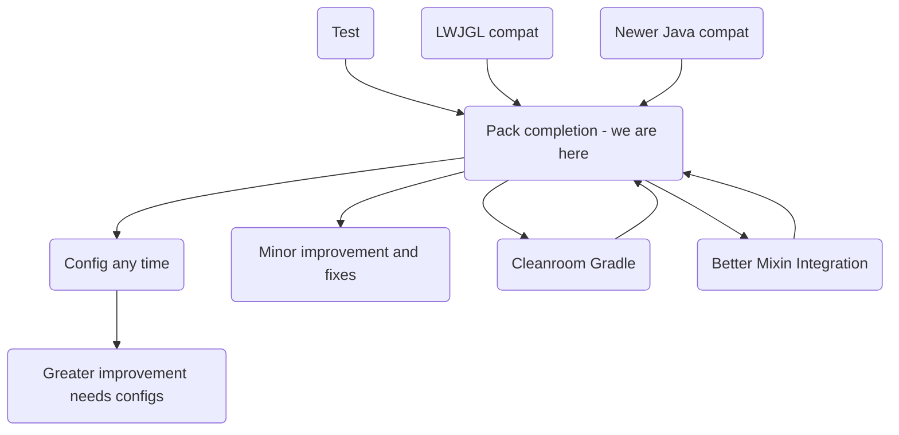

---

# $$\text{\color{orange}{Features}}$$
* A custom QuestLine (coming out soon)
* NTM space
* Back ported several features to 1.7.10

# $$\text{\color{pink}{Credits}}$$

* Thanks to GTNH for all the forks of the mods

# $$\text{\color{orange}{ModList}}$$

[TX-Loader](https://github.com/GTNewHorizons/TX-Loader/releases)
[EnderIO](https://github.com/GTNewHorizons/EnderIO/releases)
[HBM NTFork](https://github.com/JameH2/Hbm-s-Nuclear-Tech-GIT)
[Computronics](https://github.com/GTNewHorizons/Computronics/releases)
[ServerUtilities ](https://github.com/GTNewHorizons/ServerUtilities/releases)
[CodeChickenCore ](https://github.com/GTNewHorizons/CodeChickenCore/releases)
[GTNHLib](https://github.com/GTNewHorizons/GTNHLib/releases)
[Hodgepodge](https://github.com/GTNewHorizons/Hodgepodge/releases) 
[MouseTweaks](https://github.com/GTNewHorizons/MouseTweaks/releases)
[NecroTempus](https://github.com/CrucibleMC/NecroTempus) 
[NeiAddons](https://github.com/GTNewHorizons/neiaddons/releases)
[NotEnoughItems](https://github.com/GTNewHorizons/NotEnoughItems/releases)
[OmniConfig](https://github.com/CrucibleMC/Omniconfig/releases) 
[UniMixins](https://github.com/LegacyModdingMC/UniMixins/releases)
[Angelica](https://github.com/GTNewHorizons/Angelica/releases) 
[AE2](https://github.com/GTNewHorizons/Applied-Energistics-2-Unofficial/releases)
[AE2FluidCraft-Rework](https://github.com/GTNewHorizons/AE2FluidCraft-Rework/releases)
[Ae2Stuff](https://github.com/GTNewHorizons/ae2stuff/releases)
[RWG](https://github.com/GTNewHorizons/Realistic-World-Gen/releases) 
[Custom-Main-Menu](https://github.com/GTNewHorizons/Custom-Main-Menu)
[WirelessCraftingTerminal](https://github.com/GTNewHorizons/WirelessCraftingTerminal)
[ProjectRed](https://github.com/GTNewHorizons/ProjectRed)
[WAWLA](https://github.com/GTNewHorizons/WAWLA/releases)
[EnderCore](https://github.com/GTNewHorizons/EnderCore/releases)
[ForgeMultipart](https://github.com/GTNewHorizons/ForgeMultipart/releases)
[MrTJPCore](https://github.com/GTNewHorizons/MrTJPCore/releases)
[waila](https://github.com/GTNewHorizons/waila/releases)
[BetterQuesting](https://github.com/GTNewHorizons/BetterQuesting/releases)
[BetterLoadingScreen](https://github.com/GTNewHorizons/BetterLoadingScreen/releases)
[DefaultServerList](https://github.com/GTNewHorizons/DefaultServerList/releases)
[NaturesCompass](https://github.com/GTNewHorizons/NaturesCompass/releases)
[Netherlicious](https://www.curseforge.com/minecraft/mc-mods/netherlicious)
[Et Futurum Requiem](https://www.curseforge.com/minecraft/mc-mods/et-futurum-requiem)
[Campfire Backport](https://www.curseforge.com/minecraft/mc-mods/campfire-backport)
[Climate-Control](https://github.com/GTNewHorizons/Climate-Control/releases)
[NetherPortalFix](https://github.com/GTNewHorizons/NetherPortalFix)
[Elsewhere-border ](https://www.curseforge.com/minecraft/mc-mods/elsewhere-border)
[lumy-skin-patch](https://www.curseforge.com/minecraft/mc-mods/lumy-skin-patch)
[Chisel](https://github.com/GTNewHorizons/Chisel/releases)
[Baubles](https://github.com/GTNewHorizons/Baubles/releases)
[CoFH Core](https://www.curseforge.com/minecraft/mc-mods/cofh-core/files/all?page=1&pageSize=20&version=1.7.10)
[bdlib](https://github.com/GTNewHorizons/bdlib/releases)
[AsieLib](https://github.com/GTNewHorizons/AsieLib/releases)
[craftpresence](https://www.curseforge.com/minecraft/mc-mods/craftpresence/files/all?page=1&pageSize=20&version=1.7.10)
[SkinPort](https://www.curseforge.com/minecraft/mc-mods/skinport/files/all?page=1&pageSize=20)
[NotEnoughIds](https://github.com/GTNewHorizons/NotEnoughIds/releases)
[BetterCrashes](https://github.com/GTNewHorizons/BetterCrashes/releases)
[UniLib](https://www.curseforge.com/minecraft/mc-mods/unilib/files/all?page=1&pageSize=20&version=1.7.10)
[ForgeRelocation](https://github.com/GTNewHorizons/ForgeRelocation/releases)
[OpenComputers](https://github.com/GTNewHorizons/OpenComputers)
[Random Things](https://github.com/GTNewHorizons/Random-Things/releases)
[CraftTweaker](https://github.com/GTNewHorizons/CraftTweaker)
